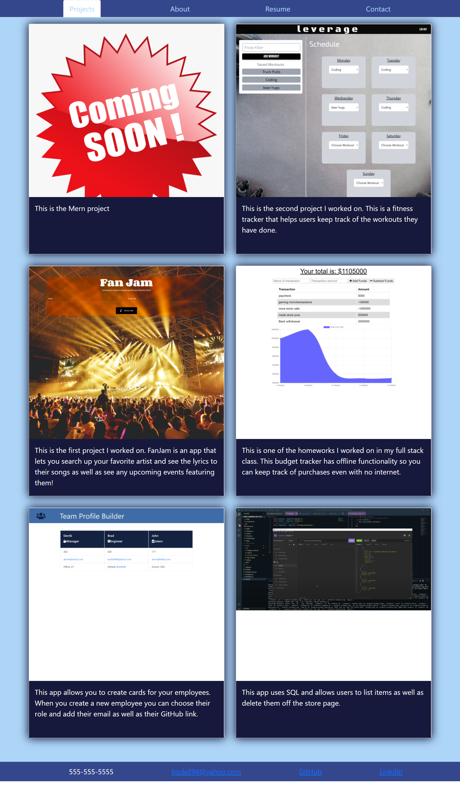

# My Portfolio

 ## Description
  This is a portfolio I made with React to showcase my work.

 ## Table of Contents
  - [Insallation](#installation)
  - [Usage](#usage)
  - [Credits](#credits)
  - [License](#license)

 ## Installation
  You must first open the package.json in your terminal and then run npm -i. once you install the packages run npm i express to install express server. after that open the server.js file into your terminal and run node server.js and it will show you are connected to a local host. once the server is up and running go to your browser and enter http://localhost:3000/. 

 ## Usage
  My react portfolio can be used to learn more about me as well as see the work I have done. Included are links to my online presence.

 ## Credits
  [BradMW](https://github.com/BradMW)

 ## License
  

 ## Features
  This portfolio features 6 of my own applications and projects I've worked on as well as details about me and ways to reach me. I am open to any questions and I am very excited to work with people in the future.

  Link to Netlify where the app is deployed: https://bradmw-portfolio.netlify.app/

